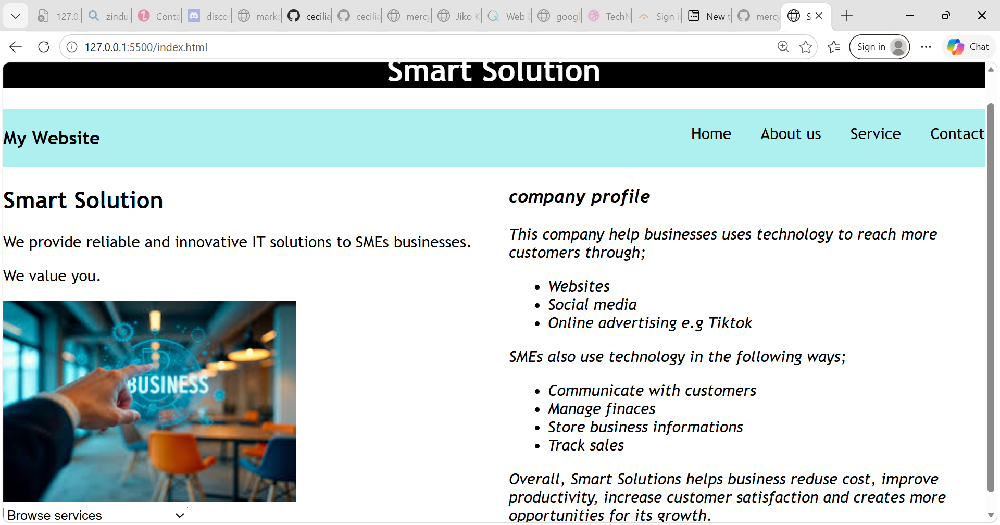
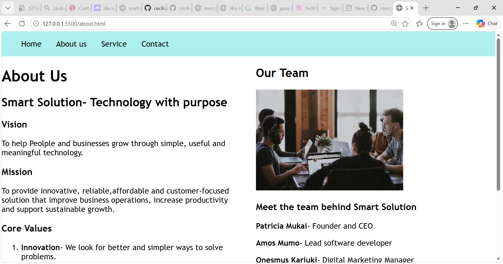
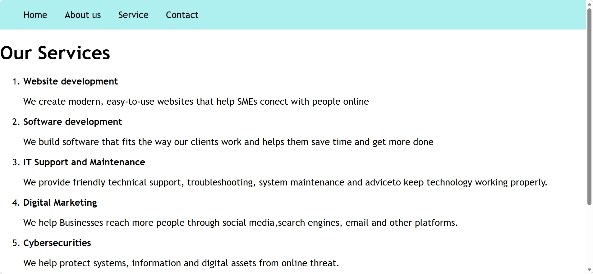
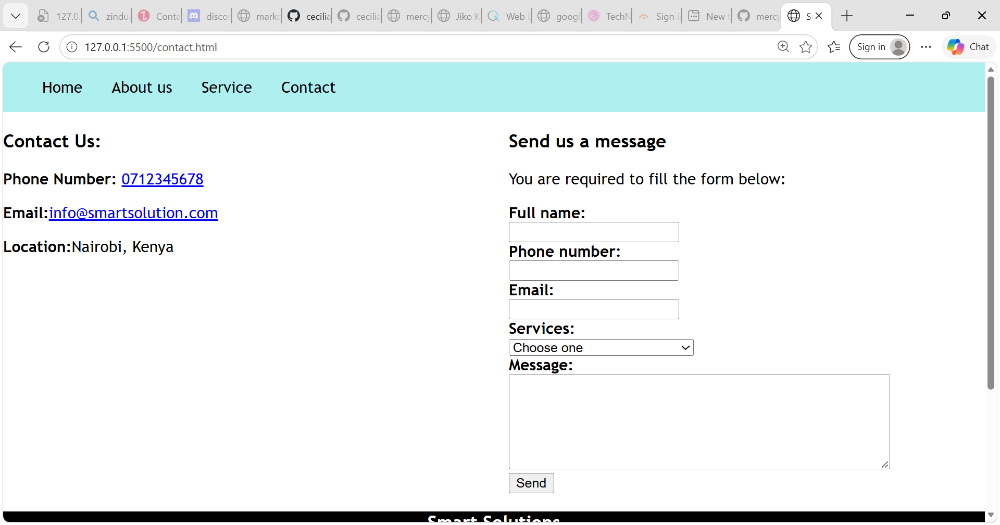

# Smart Solution

This is a website for ** Smart Solution ** a start up tech company located in Nairobi Kenya.
This company provides reliable and innovative IT solutions to SMEs businesses.

## Project Description

Smart Solutions is a responsive technology services website designed for small and medium-sized businesses (SMEs) in Nairobi, Kenya.

The website provides information about the company's IT services, and contact information. It is designed to give visitors a simple and professional way to learn about the company and its services.

## Business Role

The main goal of this company is to create a professional online presence for Smart Solutions where stakeholders will find our Products and services then choose a service that they need assistance from us.

## features

1. Home page
   This page narrates a brief profile of Smart Solutions.You can also browse and go throuhg our services
2. About Us page
   In this page you will find our mission,vision and the core values of the company. you can also be able to see the Smart Solution working Team.
3. Services page
   This page elaborates all the services offered.
4. contact page
   This Page gives the address, phone and email, plus a form for booking any service need and a comment section.

## Technologies Used

-HTML5
-Git and GitHub for version control
-GitHub Pages for hosting
-Visual Studio Code
-AI

## Project Structure

## Setup Instructions

### Run it on your computer

1. Clone the repository
2. Go into the project folder
3. Open index.html in your browser (Chrome, Firefox or Safari). You can also right-click index.html in VS Code and choose Open with Live Server.

## Deploy to GIT HUB pages

- Push the project to a GitHub repository.
- In the repository, go to Settings → Pages.
- Under Branch, choose main and the / (root) folder, then click Save.
- Wait a minute or two, then open https:
## Screenhorts

## Author

Mercy Mutua, Zindua School, Web Development Fundamentals (Week 1: HTML)
